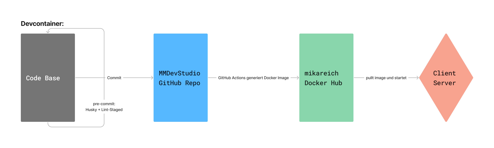

# Nextjs Template

Eine Template Repository für Nextjs Projekte mit Tailwindcss und Typescript.

## Tech-Stack

- [Next.js](https://nextjs.org): React Framework
- [Tailwind CSS](https://tailwindcss.com/): CSS Utility Framework
- [Typescript](https://www.typescriptlang.org/): Typed JavaScript
- [ESLint](https://eslint.org/): Linter
- [Prettier](https://prettier.io/): Code Formatter
- [Husky](https://typicode.github.io/husky/): Git Hooks
- [lint-staged](https://github.com/lint-staged/lint-staged): Run linters against staged git files
- [Docker](https://docker.com/): Container Platform
- [VSCode Dev Container](https://code.visualstudio.com/docs/devcontainers/containers): Development Environment

## Setup

Um das Projekt zu starten, muss [Docker](https://docker.com/), [VS Code](https://code.visualstudio.com/) und die Erweiterung für [Dev Container](https://marketplace.visualstudio.com/items?itemName=ms-vscode-remote.remote-containers) installiert sein. Ist alles installiert, fragt VS Code beim Öffnen des Projekts, ob der [Dev Container](#dev-container) gestartet werden soll. Alternativ kann man den Dev Container auch manuell starten, indem man die Command Palette (`STRG + SHIFT + P`) öffnet und nach `Remote-Containers: Reopen in Container` sucht. Der Dev Container ist so konfiguriert, dass er beim Starten automatisch die Dependencies installiert. Alles was man jetzt noch machen muss, ist den Befehl `npm run dev` auszuführen. Das Projekt ist dann unter [localhost:3000](http://localhost:3000) erreichbar.

## Workflow

Zuerst wird das Projekt im [Dev Container](#dev-container) gestartet. Will man Code pushen, wird der Code zuerst von [Husky und Lint Staged](#husky-und-lint-staged) überprüft. Ist der Code fehlerfrei, wird er zur GitHub Repository gepusht. Dort durchläuft der Code die [GitHub Actions](#github-actions). Diese erstellen ein Docker Image und pushen es zum [Docker Hub](https://hub.docker.com/). Von dort aus kann das Image auf einen Server deployed und gestartet werden.

## Dev Container

Ein Dev Container ist eine Entwicklungsumgebung, die in einem Docker Container läuft. Der Container wird mit einem Dockerfile definiert und kann mit einer `devcontainer.json` konfiguriert werden. Das Projekt ist so konfiguriert, dass beim Starten bzw. bei Veränderung des Inhalts des Containers die Dependencies installiert werden. Außerdem werden einige VS Code Erweiterungen installiert. Die Erweiterungen können in der `devcontainer.json` konfiguriert werden.

## GitHub Actions

GitHub Actions sind automatisierte Workflows, die auf GitHub ausgeführt werden. In diesem Projekt werden sie verwendet, um ein Docker Image zu erstellen und es auf den Docker Hub zu pushen. Die Actions werden in der `.github/workflows` definiert. Die verwendete Dockerkonfiguration befindet sich in dem `Dockerfile`. **Achtung**: Wenn man diese neu einrichtet, muss man die benötigten Umgebungsvariablen `DOCKERHUB_USERNAME` und `DOCKERHUB_TOKEN` in den Repository Secrets hinterlegen.

# Husky und Lint Staged

Husky und Lint Staged sind zwei Tools, die zusammenarbeiten, um sicher zu stellen, dass nur Code committed wird, der den Linting Regeln entspricht. Husky ist ein Tool, das es ermöglicht, Git Hooks zu definieren. Lint Staged ist ein Tool, das es ermöglicht, Linting Regeln auf die **gestageten Dateien** anzuwenden.

## Eslint und Prettier

Was Eslint und Prettier machen, dürfte klar sein. Eslint verwendet in diesem Projekt die Konfiguration von AirBnB mit ein paar extras. Prettier benutzt das `prettier-plugin-tailwindcss`, was tailwind klassen sortiert.
